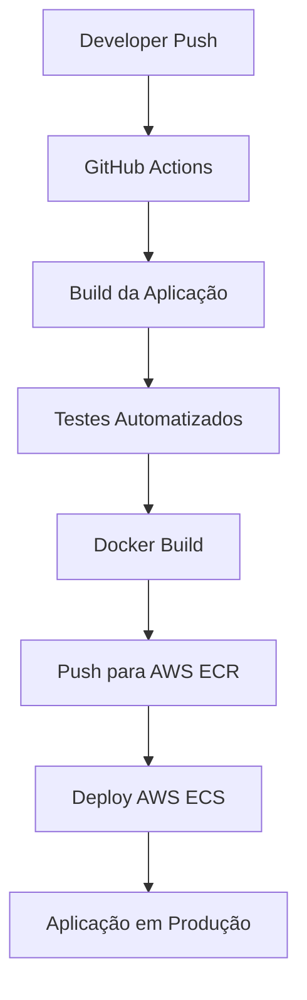

# 🚀 Projeto CI/CD com GitHub Actions + Docker + AWS ECS

Sistema de automação de deploy utilizando práticas modernas de DevOps e Cloud Computing.

---

## 📌 Objetivo

Este projeto demonstra um fluxo completo de **CI/CD profissional** utilizando:

- GitHub Actions
- Docker
- AWS ECS
- AWS ECR
- Deploy automatizado
- Pipeline sem downtime

A ideia é simular uma arquitetura moderna utilizada em ambientes reais de produção.

---

# 🏗️ Arquitetura do Fluxo



---

# ⚙️ Tecnologias Utilizadas

## DevOps
- Docker
- GitHub Actions
- AWS ECS
- AWS ECR
- YAML Pipelines

## Backend
- Node.js
- Python

## Versionamento
- Git
- GitHub

---

# 📂 Estrutura do Projeto

```bash
.
├── .github/
│   └── workflows/
│       └── deploy.yml
├── src/
├── Dockerfile
├── docker-compose.yml
├── package.json
└── README.md
```

---

# 🔄 Pipeline CI/CD

## Continuous Integration (CI)

A cada `push` ou `pull request`:

- Instala dependências
- Executa lint
- Roda testes
- Valida build

---

## Continuous Delivery (CD)

Após merge na branch principal:

- Cria imagem Docker
- Publica no AWS ECR
- Atualiza serviço ECS
- Realiza deploy automatizado

---

# 🐳 Docker

## Build da aplicação

```bash
docker build -t app-ci-cd .
```

## Executar container

```bash
docker run -p 3000:3000 app-ci-cd
```

---

# ☁️ Deploy AWS ECS

O deploy utiliza:

- Amazon ECS
- Amazon ECR
- IAM Roles
- GitHub Secrets

---

# 🔐 Variáveis de Ambiente

Secrets configurados no GitHub:

```env
AWS_ACCESS_KEY_ID=
AWS_SECRET_ACCESS_KEY=
AWS_REGION=
ECR_REPOSITORY=
ECS_SERVICE=
ECS_CLUSTER=
```

---

# 🛡️ Boas Práticas Aplicadas

- Deploy automatizado
- Pipeline CI/CD
- Containers Docker
- Separação de ambientes
- Segurança com GitHub Secrets
- Infraestrutura escalável
- Deploy sem downtime

---

# 🚀 Executando Localmente

## Clonar repositório

```bash
git clone https://github.com/higorvitorpadilha/Projeto-CI-CD.git
```

## Entrar na pasta

```bash
cd Projeto-CI-CD
```

## Subir containers

```bash
docker-compose up --build
```

---

# 📸 Workflow em Execução

Adicione prints aqui:

- GitHub Actions rodando
- ECS funcionando
- Logs da pipeline
- Deploy concluído

---

# 📈 Melhorias Futuras

- [ ] Terraform
- [ ] Kubernetes
- [ ] SonarQube
- [ ] Testes E2E
- [ ] Blue/Green Deployment
- [ ] CloudWatch
- [ ] Grafana

---

# 🧠 Conceitos Aplicados

- CI/CD
- DevOps
- Cloud Computing
- Containers
- Infraestrutura Automatizada
- Deploy Contínuo
- Dockerização

---

# 👨‍💻 Autor

Desenvolvido por **Higor Padilha**.

📎 LinkedIn:  
https://www.linkedin.com/in/higor-padilha-41aaa426/

---

# ⭐ Diferenciais do Projeto

✅ Deploy automatizado na AWS  
✅ Pipeline profissional  
✅ Estrutura escalável  
✅ Dockerização completa  
✅ Integração contínua  
✅ Fluxo próximo de ambiente real de produção
